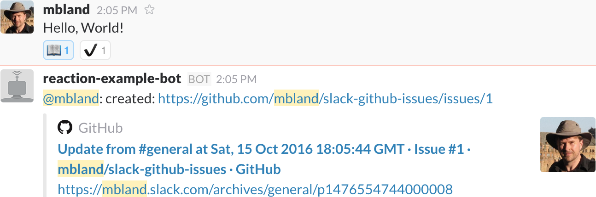

# Slack-to-GitHub Issues: Uses Slack `reaction_added` events to file GitHub issues

<!-- [](https://nodei.co/npm/slack-github-issues/)<br/> -->

Source: https://github.com/mbland/slack-github-issues

When a [Slack](https://slack.com/) chat message receives a specific emoji
reaction, this package creates a [GitHub](https://github.com/) issue with a link
to that message.

This feature is for teams who use Slack to communicate and GitHub to track
issues. It provides an easy way to file an issue (just add a specific emoji to a
message), which helps team members (even non-technical ones!) quickly document
or act upon important parts of conversations.

<figure>
<br/>
<figcaption>Example of filing an issue by reacting to a message with a
<code>book</code> emoji. After successfully filing an issue, the bot application
using this package marked the message with a <code>heavy_check_mark</code> emoji
and posted the issue URL to the channel.</figcaption>
</figure>

## Table of contents

- [How it works](#how-it-works)
- [What's different from mbland/hubot-slack-github-issues?](#whats-different)
- [Installation and usage](#installation-and-usage)
- [Configuration](#configuration)
- [Feedback and contributions](#feedback-and-contributions)
- [Open Source license](#open-source-license)
- [Prior work](#prior-work)

## How it works

When team members add an emoji reaction to a message, Slack will send your
application a [`reaction_added`
event](https://api.slack.com/events/reaction_added). Your application should
pass this event to this package's `ReactionIssueFiler` class, which will match
the event against a set of [configuration rules](#configuration). If the event
matches a rule, the `ReactionIssueFiler` will [retrieve the list of
reactions](https://api.slack.com/methods/reactions.get) for the message.

If the message doesn't have an emoji reaction indicating an issue was already
filed (the `successReaction` configuration property), `ReactionIssueFiler` will
[create a GitHub issue](https://developer.github.com/v3/issues/#create-an-issue)
for the message. The issue will contain a link to the message. At this point,
the `ReactionIssueFiler` will [react to the message with a `successReaction`
emoji](https://api.slack.com/methods/reactions.add). Finally, it will return the
issue URL to the application.

## <a id='whats-different'></a>What's different from mbland/hubot-slack-github-issues?

This package has been refactored heavily to ensure the core logic is 100%
asynchronous and no longer depends directly on any Hubot or Slack Real Time
Messaging client details, which are now encapsulated within the
[hubot/slack-github-issues.js script](./hubot/slack-github-issues.js) and the
[`SlackRtmDataStore` class](./lib/slack-rtm-data-store.js).

[mbland/hubot-slack-github-issues](https://github.com/mbland/hubot-slack-github-issues)
remains as a convenience wrapper around this package specifically for use with
[Hubot](https://hubot.github.com/).

## Installation and usage

Here are instructions for installing this package and putting it into use in
your application. If your bot is implemented using Hubot, see the [Hubot
integration instructions](#hubot-integration) as well.

1. Install [Node.js](https://nodejs.org/) on your system. This package requires
   version 4.2 or greater or version 5 or greater. You may wish to first install
   a version manager such as [nvm](https://github.com/creationix/nvm) to manage
   and install different Node.js versions.

1. In your application repository, run:
   ```bash
   $ npm install slack-github-issues --save
   ```

   **Note:** The `SlackRtmDataStore` class depends upon the
   [@slack/client package](https://www.npmjs.com/package/@slack/client).
   Make sure to install it if you intend to use the [Slack Real Time Messaging
   API](https://api.slack.com/rtm) in your application.

1. If you haven't done so already, create a [Slack bot
   user](https://api.slack.com/bot-users). Use the bot's API token as the value
   for the `slackApiToken` configuration file property (see the **Note on API
   tokens** from [the instructions for configuring the
   package](#configure-the-package)). If using the Hubot script, assign it to
   the `HUBOT_SLACK_TOKEN` environment variable instead.

1. Decide on a GitHub user that will file issues on behalf of the script. If you
   don't wish to use an existing user, you may [create a GitHub
   account](https://help.github.com/articles/signing-up-for-a-new-github-account/)
   dedicated to this purpose and add this account to your GitHub organization if
   applicable. Create a [personal access
   token](https://help.github.com/articles/creating-an-access-token-for-command-line-use/)
   for this user and use it as the value for the `githubApiToken` configuration
   file property (see the **Note on API tokens** from [the instructions for
   configuring the package](#configure-the-package)). If using the Hubot script,
   assign it to the `HUBOT_GITHUB_TOKEN` environment variable instead.

   **If you wish to use this script with private GitHub repositories**, [add
   your GitHub user as a
   collaborator](https://help.github.com/articles/adding-outside-collaborators-to-repositories-in-your-organization/)
   with [read
   access](https://help.github.com/articles/repository-permission-levels-for-an-organization/)
   to each repository. Alternatively, you can [add your GitHub user to a
   team](https://help.github.com/articles/adding-organization-members-to-a-team/)
   with access to private repositories instead.

1. Create a [configuration](#configuration) file or object as described below.
   Integrate it into your application per [the instructions for configuring the
   package](#configure-the-package). If using the Hubot script, assign the path
   to `HUBOT_SLACK_GITHUB_ISSUES_CONFIG_PATH` instead.

1. Run your bot locally or otherwise deploy to your preferred environment.

### Hubot integration

You can easily integrate this package into a [Hubot](https://hubot.github.com/)
instance using the [mbland/hubot-slack-github-issues package](https://github.com/mbland/hubot-slack-github-issues).
Alternatively, you may use the [hubot/slack-github-issues.js script](./hubot/slack-github-issues.js)
that ships with this package:

1. [Create your own Hubot instance](https://hubot.github.com/docs/) if you
   haven't already done so. Note that you do not need to install Redis to use
   this script.

1. Ensure that you're using Hubot v2.19.0 or greater and
   [hubot-slack](https://npmjs.com/packages/hubot-slack) v4.2.1 or greater by
   including the following in your instance's `package.json` and running `npm
   install`:

   ```json
   "dependencies": {
      "hubot": "^2.19.0",
      "hubot-slack": "^4.2.1"
   }
   ```

1. Set the following environment variables (how to do that depends on the
   operating system and shell that you use; [here's an example guide for OS X
   with the default bash shell](http://osxdaily.com/2015/07/28/set-enviornment-variables-mac-os-x/)):

   * `HUBOT_GITHUB_TOKEN`: personal API token for the GitHub user
   * `HUBOT_SLACK_TOKEN`: API token for the Slack bot user
   * `HUBOT_SLACK_GITHUB_ISSUES_CONFIG_PATH` **(optional)**: the path to the
     configuration file; defaults to `config/slack-github-issues.json`

1. Add the following to one of your bot's existing scripts:
   ```js
   require('slack-github-issues').loadHubotScript(robot);
   ```
   or add a new script like the following:
   ```js
   'use strict';

   module.exports = function(robot) {
     require('slack-github-issues').loadHubotScript(robot);
   };
   ```

1. Run `hubot --adapter slack` locally or otherwise deploy to your preferred
   environment.

### Integration into other bot applications

If you're writing a bot using a different framework or your own application
structure, the following explains the necessary steps:

1. Import this package into your application code:

   ```js
   var slackGitHubIssues = require('slack-github-issues');
   ```

1. <a id='configure-the-package'></a>[Configure the
   package](#configuration) by creating a `configParams` object with exactly
   one of these two properties:
   * `data`: an Object containing the configuration data
   * `path`: a path to the file containing the configuration data as JSON,
     relative to the root directory of the running instance of the application:

   ```js
   var configParams = { path: 'config/slack-github-issues.json' };
   ```

   **Note on API tokens**: If you define your configuration in a file stored in
   version control, you may wish to keep API tokens out of it. You can add an
   `updates` property to `configParams` that you create from your application's
   environment variables.  Note that you should _not_ define
   `configParams.updates` as an object literal, because `process.env` will not
   contain any values at the time the literal is instantiated. (You can also set
   `configParams.path` this way.)

   ```js
   configParams.path = process.env.SLACK_GITHUB_ISSUES_CONFIG_PATH;
   configParams.updates.slackApiToken = process.env.SLACK_API_TOKEN;
   configParams.updates.githubApiToken = process.env.GITHUB_API_TOKEN;
   ```

1. Create a data store object patterned after `SlackRtmDataStore`. If you're
   using an instance of `RtmClient` from
   [@slack/client](https://www.npmjs.com/package/@slack/client) and the
   [Slack Real Time Messaging API](https://api.slack.com/rtm), create an
   instance of `SlackRtmDataStore` by passing the `RtmClient` to
   `SlackRtmDataStore`:

   ```js
   var slackDataStore = slackGitHubIssues.slackRtmDataStore(slackRtmClient);
   ```

   If your application is running across multiple instances, you will need to
   define your own Slack data store with the same interface as
   `SlackRtmDataStore`:

   ```js
   var slackDataStore = new MyDistributedAppSlackDataStore;
   ```

1. If not already present, add a logging object to your application that
   supports the `info()` and `error()` methods, such as
   [log](https://www.npmjs.com/package/log). You can pass this logger directly
   to the methods described below, but it's recommended that you wrap it using
   the `Logger` class from this library, which prefixes this package's messages
   with the package name:
   ```js
   var Log = require('log');
   var logger = slackGitHubIssues.logger(new Log);
   ```

1. Create a `ReactionIssueFiler` instance by using the appropriate factory. For
   bot applications that will run as a single instance, use
   `singleInstanceReactionIssueFiler`:

   ```js
   var reactionIssueFiler = slackGitHubIssues.singleInstanceReactionIssueFiler(
     configParams, slackDataStore, logger);
   ```

   This factory will use the in-memory `MessageLock` class to ensure only one
   handler instance per matching event executes at a time. If your application
   is running across multiple instances, you will need to define your own class
   with the same interface as `MessageLock`, then pass this to the
   `reactionIssueFiler()` factory:

   ```js
   var messageLock = new MyDistributedAppMessageLock;
   var reactionIssueFiler = slackGitHubIssues.reactionIssueFiler(
     configParams, slackDataStore, messageLock, logger);
   ```

1. Register a handler for [`reaction_added`
   events](https://api.slack.com/events/reaction_added) that passes the
   event object to `reactionIssueFiler.execute()` and responds appropriately:

   ```js
   reactionIssueFiler.execute(reaction_added_message)
     .then(function(issueUrl) {
       handleSuccess('created: ' + issueUrl);
     })
     .catch(function(err) {
       if (err) {
        handleError('error filing issue: ' + err.message);
       }
     });
   ```

   Note that `execute()` will return `Promise.reject(null)` when events are
   ignored, to differentiate from actual
   [Error](https://developer.mozilla.org/en-US/docs/Web/JavaScript/Reference/Global_Objects/Error)
   instances.

## Configuration

To create a configuration file template, run:

```sh
$ bin/slack-github-issues print-template > slack-github-issues.json
```

Edit this file as necessary, then validate the configuration by running:

```sh
$ bin/slack-github-issues validate path-to-config.json
```

### Schema

The JSON configuration file must conform to the following schema:

* **githubUser**: GitHub organization or username owning all repositories
* **githubApiToken**: [Personal access
  token](https://help.github.com/articles/creating-an-access-token-for-command-line-use/)
  for the user that will file GitHub issues on behalf of your application (see
  [the **NOTE** below](#api-tokens))
* **githubTimeout**: GitHub API timeout limit in milliseconds
* **slackApiToken**: API token for the [Slack bot
  user](https://api.slack.com/rtm) under which your app will run (see [the
  **NOTE** below](#api-tokens))
* **slackTimeout**: Slack API timeout limit in milliseconds
* **successReaction**: emoji used to indicate an issue was successfully filed
* **githubApiBaseUrl (optional)**: Override of the default GitHub API URL;
  chiefly used when running a local test server
* **slackApiBaseUrl (optional)**: Override of the default Slack API URL;
  chiefly used when running a local test server
* **rules**: defines each condition that will result in a new GitHub issue
  * **reactionName**: name of the reaction emoji triggering the rule
  * **githubRepository**: GitHub repository belonging to *githubUser* to which
    to post issues
  * **channelNames (optional)**: name of the Slack channels triggering the
    rule; leave undefined to match messages in _any_ Slack channel

<a id='api-tokens'></a>**NOTE: DO NOT STORE `slackApiToken` and `githubApiToken`
IN SOURCE CONTROL!** Use environment variables and programmatically set these
properties after loading the file as demonstrated in the **Note on API tokens**
from [the instructions for configuring the package](#configure-the-package).

For example:

```json
{
  "githubUser": "mbland",
  "githubApiToken": "<github-api-token>",
  "slackApiToken": "<slack-api-token>",
  "githubTimeout": 5000,
  "slackTimeout": 5000,
  "successReaction": "heavy_check_mark",
  "rules": [
    {
      "reactionName": "book",
      "githubRepository": "slack-github-issues"
    }
  ]
}
```

For a more complete example, see
[`test/helpers/test-config.json`](./test/helpers/test-config.json) in this
repository.

### Validating the config file

Run the following (replacing `slack-github-issues.json` with whatever file name
you chose earlier):

```sh
$ bin/slack-github-issues validate slack-github-issues.json
```

If it passes, you will see:

```sh
slack-github-issues.json: OK
```

Otherwise, an error message will report all schema and constraint violations.

### Configuration constraints

To keep the configuration file readable, `rules:` must be sorted according to
the following ordering rules. The script will abort otherwise:

- `reactionName` in lexicographic order
- rules that do not define `channelNames` must follow any other rules for the
  same `reactionName`, so that more specific rules are matched first
- `githubRepository` in lexicographic order

To ensure that rules behave as expected, the script also enforces
following conditions for each set of rules pertaining to a `reactionName`:

- Each rule's `channelNames` list is sorted
- Each `githubRepository` value is unique
- Each value in `channelNames` is unique across every rule
- Only the last rule can leave `channelNames` undefined, as this rule will
  match messages in every channel not matched by other rules

## Feedback and contributions

Feel free to [comment on or file a new GitHub
issue](https://github.com/mbland/slack-github-issues/issues) or otherwise ping
[@mbland](https://github.com/mbland) with any questions or comments you may
have, especially if the current documentation hasn't addressed your needs.

If you'd care to contribute to this project, be it code fixes, documentation
updates, or new features, please read the [CONTRIBUTING](CONTRIBUTING.md) file.

## Open Source license

This software is made available as [Open Source
software](https://opensource.org/osd-annotated) under the [ISC
License](https://www.isc.org/downloads/software-support-policy/isc-license/).
For the text of the license, see the [LICENSE](LICENSE.md) file.

## Prior work

This package was extracted from
[mbland/hubot-slack-github-issues](https://github.com/mbland/hubot-slack-github-issues),
which was forked from
[18F/hubot-slack-github-issues](https://github.com/18F/hubot-slack-github-issues).
For the detailed source history prior to the inception of this repository, see
https://github.com/mbland/hubot-slack-github-issues/commits/slack-github-issues-begin.
